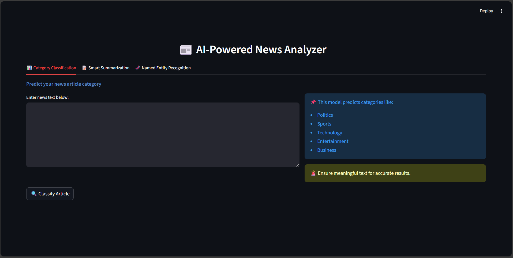
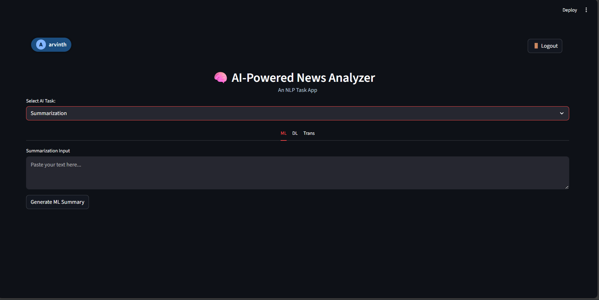
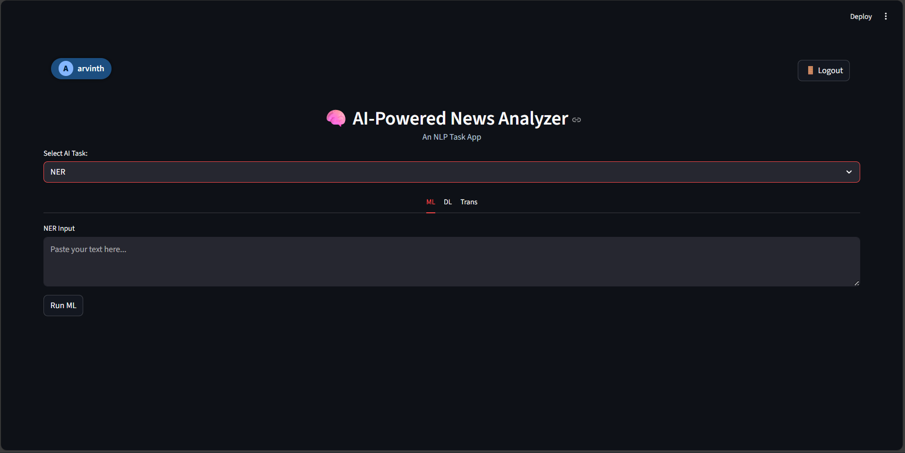

<h1 align="center">📰 Multi-Task News Intelligence System</h1>
<h3 align="center">Classification • Summarization • Named-Entity Recognition 
Built using ML, DL, Transformer Models &amp; Deployed on Cloud</h3>

<h2>🚀 Project Overview</h2>

This project is an <strong>end-to-end NLP-based News Understanding System</strong> that performs:

<ul>
  <li><strong>Text Classification</strong> (e.g., Politics, Sports, Business, Tech, Entertainment)</li>
  <li><strong>Named Entity Recognition (NER)</strong> (Person, Organization, Location, Date)</li>
  <li><strong>Abstractive Summarization</strong></li>
</ul>

The project implements <strong>three approaches per task</strong>:

<ul>
  <li>Traditional Machine Learning</li>
  <li>Custom Deep Learning Architectures</li>
  <li>Fine-Tuned Transformer Models</li>
</ul>

A unified <strong>Streamlit Web Application</strong> is built for inference and can be deployed on cloud infrastructure.

<h2>💡 Key Features</h2>

<table>
  <thead>
    <tr>
      <th>Feature</th>
      <th>Description</th>
    </tr>
  </thead>
  <tbody>
    <tr>
      <td>News Classification</td>
      <td>Fine-tuned BERT model identifies the news category.</td>
    </tr>
    <tr>
      <td>Smart Summarization</td>
      <td>Fine-tuned BART model produces multi-sentence abstractive summaries.</td>
    </tr>
    <tr>
      <td>Named Entity Recognition</td>
      <td>Transformer-based NER extracts entities like PER, ORG, LOC, DATE.</td>
    </tr>
    <tr>
      <td>Multi-model Comparison</td>
      <td>Compare From-Scratch ML, From-Scratch DL, and Transformer models.</td>
    </tr>
    <tr>
      <td>Cloud Ready</td>
      <td>Architecture designed for EC2 + S3 + RDS deployment.</td>
    </tr>
    <tr>
      <td>Logging Support</td>
      <td>Schema and design ready for storing user inference logs.</td>
    </tr>
  </tbody>
</table>

<h2>🧱 System Architecture</h2>

<h3>🔹 Model Pipeline</h3>
<pre><code>Data Processing → Feature Engineering → ML/DL Models → Transformer Models → UI Deployment
</code></pre>

<h3>🔹 Deployment Structure (Suggested)</h3>
<pre><code>AWS EC2 — Hosts Streamlit Application
AWS S3  — Stores trained models &amp; preprocessing objects
AWS RDS — Stores user inference logs
</code></pre>

<h2>📂 Project Structure</h2>

<pre><code>.
|-- Classification/
|   |-- Bert/                       # Fine-tuned BERT classifier
|   |-- label_encoder.pkl
|
|-- NER/
|   |-- bert_ner_model/             # Fine-tuned BERT token-classification model
|   |-- Models/
|       |-- id2tag.pkl
|
|-- Summarization/
|   |-- bart_Summary_finetuned/     # Fine-tuned BART summarizer
|
|-- app.py                          # Streamlit UI for Classification, NER, Summarization
|-- requirements.txt
|-- README.md
</code></pre>

<h2>🧠 Machine Learning &amp; NLP Models Implemented</h2>

<h3>✔ Classification Models</h3>
<table>
  <thead>
    <tr>
      <th>Approach</th>
      <th>Models / Techniques</th>
    </tr>
  </thead>
  <tbody>
    <tr>
      <td>Traditional ML</td>
      <td>Logistic Regression, Linear SVM, Multinomial Naive Bayes (with BoW/TF-IDF)</td>
    </tr>
    <tr>
      <td>Custom Deep Learning</td>
      <td>LSTM / BiLSTM classifier with Word Embeddings (Word2Vec / GloVe)</td>
    </tr>
    <tr>
      <td>Transformers</td>
      <td>Fine-tuned <code>bert-base-uncased</code> (Sequence Classification)</td>
    </tr>
  </tbody>
</table>

<h3>✔ NER Models</h3>
<table>
  <thead>
    <tr>
      <th>Approach</th>
      <th>Models / Techniques</th>
    </tr>
  </thead>
  <tbody>
    <tr>
      <td>Rule-Based Baseline</td>
      <td>Regex and heuristic rules for capitalized words, dates, and patterns</td>
    </tr>
    <tr>
      <td>Custom Deep Learning</td>
      <td>BiLSTM / BiLSTM-CRF trained on token-level BIO tags</td>
    </tr>
    <tr>
      <td>Transformers</td>
      <td>Fine-tuned BERT Token Classification model for NER</td>
    </tr>
  </tbody>
</table>

<h3>✔ Summarization Models</h3>
<table>
  <thead>
    <tr>
      <th>Approach</th>
      <th>Models / Techniques</th>
    </tr>
  </thead>
  <tbody>
    <tr>
      <td>Extractive Baseline</td>
      <td>TF-IDF based sentence ranking / TextRank</td>
    </tr>
    <tr>
      <td>Custom Seq2Seq</td>
      <td>LSTM encoder–decoder with attention for abstractive summaries</td>
    </tr>
    <tr>
      <td>Transformers</td>
      <td>Fine-tuned BART model (<code>BartForConditionalGeneration</code>)</td>
    </tr>
  </tbody>
</table>

<h2>🧪 Evaluation Highlights</h2>

<h3>Classification</h3>
<ul>
  <li>Metrics: Accuracy, Precision, Recall, F1-score, Confusion Matrix</li>
  <li>Comparison across: BoW vs TF-IDF vs Word2Vec, ML vs DL vs BERT</li>
</ul>

<h3>Named Entity Recognition</h3>
<ul>
  <li>Metrics: Precision, Recall, F1-score (micro and per-entity type)</li>
  <li>Comparison: Rule-Based vs BiLSTM(-CRF) vs Transformer NER</li>
</ul>

<h3>Summarization</h3>
<ul>
  <li>Metrics: ROUGE-1, ROUGE-2, ROUGE-L</li>
  <li>Comparison: Extractive baselines vs Seq2Seq vs Transformer (BART)</li>
</ul>

<h2>🔥 Web Application (Streamlit UI)</h2>

The <code>app.py</code> script defines a unified UI with three tabs:

<h3>📊 1. Category Classification</h3>
<ul>
  <li>Input: Free-form news article text</li>
  <li>Model: Fine-tuned BERT classifier</li>
  <li>Output: Predicted category and confidence score</li>
</ul>

<h3>📝 2. Smart Summarization</h3>
<ul>
  <li>Input: Long-form news article body</li>
  <li>Model: Fine-tuned BART summarization model using Hugging Face <code>pipeline</code></li>
  <li>Output: Multi-sentence summary rendered as bullet points</li>
</ul>

<h3>🧬 3. Named Entity Recognition</h3>
<ul>
  <li>Input: Article text</li>
  <li>Model: Fine-tuned BERT Token Classification model</li>
  <li>Output:
    <ul>
      <li>Table view of entities (Entity Type, Value)</li>
      <li>Grouped entities by label (PER, ORG, LOC, etc.)</li>
    </ul>
  </li>
</ul>

<h2>🛠️ Installation Guide</h2>

<h3>1️⃣ Clone the Repository</h3>
<pre><code>git clone &lt;your-repo-url&gt;
cd &lt;project-folder&gt;
</code></pre>

<h3>2️⃣ Create and Activate a Virtual Environment</h3>
<pre><code>conda create -n news_ai python=3.9
conda activate news_ai
</code></pre>

<h3>3️⃣ Install Dependencies</h3>
<pre><code>pip install -r requirements.txt
</code></pre>

<h3>4️⃣ Place Model Checkpoints</h3>

Ensure your directory structure matches the expected model paths:

<pre><code>./Classification/Bert/                  # Fine-tuned BERT classifier
./Classification/label_encoder.pkl

./NER/bert_ner_model/                   # Fine-tuned BERT NER model
./NER/Models/id2tag.pkl                 # ID → tag mapping

./Summarization/bart_Summary_finetuned/ # Fine-tuned BART summarizer
</code></pre>

<h2>▶ Running the Application Locally</h2>

<pre><code>streamlit run app.py
</code></pre>

By default, Streamlit runs on:
 
👉 <a href="http://localhost:8501" target="_blank">http://localhost:8501</a>

<h2>🚀 Suggested AWS Deployment</h2>

<h3>EC2 Setup</h3>
<ol>
  <li>Launch an Ubuntu-based EC2 instance.</li>
  <li>SSH into the instance and install Python, Git, and other dependencies.</li>
  <li>Clone this repository onto the instance.</li>
  <li>Download or copy the trained model directories into the expected paths.</li>
  <li>Install the Python requirements.</li>
  <li>Run the Streamlit app on a public port.</li>
</ol>

<pre><code>nohup streamlit run app.py --server.port 80 --server.address 0.0.0.0 &amp;
</code></pre>

<h3>S3 for Model Storage (Recommended)</h3>
<ul>
  <li>Store model artifacts (<code>.pt</code>, <code>.bin</code>, <code>.pkl</code>) and tokenizers in S3.</li>
  <li>Download them on EC2 at startup or on-demand (lazy loading).</li>
  <li>Use IAM roles or environment variables for secure access.</li>
</ul>

<h3>RDS for Logging (Optional but Recommended)</h3>

Example logging schema:

<table>
  <thead>
    <tr>
      <th>Field</th>
      <th>Description</th>
    </tr>
  </thead>
  <tbody>
    <tr>
      <td>user_id</td>
      <td>Identifier for user/session</td>
    </tr>
    <tr>
      <td>timestamp</td>
      <td>Time of inference</td>
    </tr>
    <tr>
      <td>task_type</td>
      <td>Classification / NER / Summarization</td>
    </tr>
    <tr>
      <td>model_family</td>
      <td>From-Scratch ML / DL / Transformer</td>
    </tr>
    <tr>
      <td>model_name</td>
      <td>e.g., <code>bert_cls</code>, <code>bilstm_ner</code>, <code>bart_summary</code></td>
    </tr>
    <tr>
      <td>input_length</td>
      <td>Token/character length of the input text</td>
    </tr>
    <tr>
      <td>output_summary_or_label</td>
      <td>Predicted label / summary length / entity count</td>
    </tr>
    <tr>
      <td>error_flag</td>
      <td>Indicates if inference failed or succeeded</td>
    </tr>
  </tbody>
</table>

<h2>🎯 Dataset</h2>

<h3>Microsoft PENS Dataset</h3>
<ul>
  <li>113k+ English news articles</li>
  <li>15 categories</li>
  <li>Contains title, body, category, and entities</li>
</ul>

Official information: <a href="https://msnews.github.io/pens" target="_blank">https://msnews.github.io/pens</a>

<h2>🔍 Business Use Cases</h2>

<ul>
  <li><strong>Intelligent News Monitoring</strong>: Classify articles and extract key entities for dashboards.</li>
  <li><strong>Reputation &amp; Brand Monitoring</strong>: Track mentions of organizations, brands, and people.</li>
  <li><strong>Due Diligence &amp; KYC</strong>: Summarize risk-related news for financial institutions.</li>
  <li><strong>Content Intelligence</strong>: Auto-tagging, summarization, and indexing for e-learning portals.</li>
  <li><strong>Regulatory Monitoring</strong>: Track law, policy, and regulatory changes from news sources.</li>
  <li><strong>Customer &amp; Sales Intelligence</strong>: Follow client-related expansions, mergers, layoffs, etc.</li>
</ul>

<h2>📈 Preview</h2>

  

  <i>Classification result screen (Predicted category + confidence).</i>

  

  <i>Summarization tab showing bullet-point summary.</i>

  

  <i>NER output with entity table and grouped display.</i>

<h2>🎓 Skill Takeaways</h2>
<ul>
  <li>Advanced text preprocessing and feature engineering.</li>
  <li>Building custom deep learning architectures (Seq2Seq, BiLSTM-CRF).</li>
  <li>Fine-tuning Hugging Face Transformer models.</li>
  <li>Model comparison and result analysis across ML/DL/Transformer paradigms.</li>
  <li>Developing and deploying interactive Streamlit applications.</li>
  <li>Designing cloud-ready architecture with EC2, S3, RDS.</li>
</ul>

<h2>📌 Future Enhancements</h2>
<ul>
  <li>Add sentiment analysis for articles and entities.</li>
  <li>Support multilingual news articles.</li>
  <li>Integrate LLM-based summarization or Q&amp;A.</li>
  <li>Introduce a continuous training &amp; model update pipeline.</li>
</ul>

<h2>🙌 Author &amp; Contributions</h2>

This project is developed as an advanced NLP capstone demonstrating:

<ul>
  <li>End-to-end multi-task NLP system design.</li>
  <li>Hands-on experimentation with ML, DL, and Transformer models.</li>
  <li>Practical deployment-oriented architecture.</li>
</ul>

Contributions, suggestions, and improvements are welcome via issues and pull requests.

